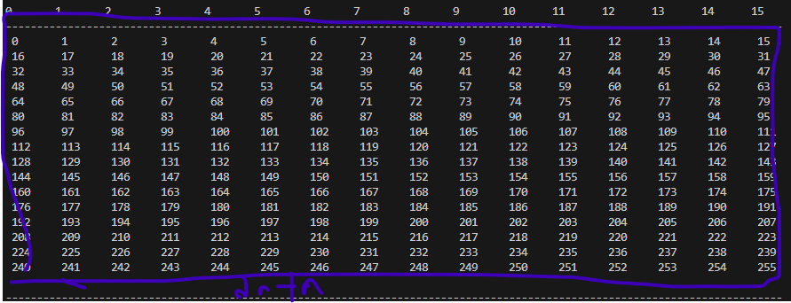

# 파일 256 바이트 씩 읽기 테스트
## 실 구현 코드 예시
```code
    DWORD  fileSize = f_size(&file);
    DWORD fileChunkNum = fileSize / 256 + 1; // 파일 크기를 256바이트 씩 몇번 읽을지
    if(fileSize >0){ 
          for(DWORD i =0; i< fileChunkNum; i++){ // 256 바이트가 청크된 갯수만큼 
            fatfsCode = f_read(&file, testBuffer, 256, (UINT *)&resultSize); // 파일을 읽음.
         }
    }
```

# 데이터 확인 할수 있도록 출력 테스트
